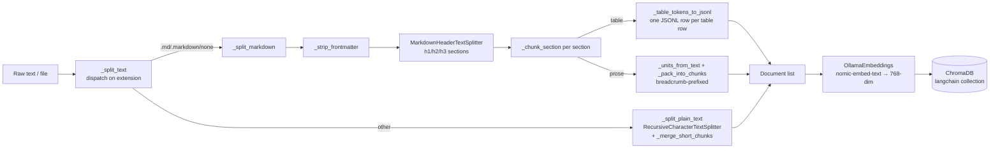

# DB Analysis — Vector Store (ChromaDB)

## Overview

bit-rag uses **ChromaDB** as the vector store. It is not a relational database; there is no SQL schema defined by the application. ChromaDB manages its own internal SQLite3 catalog (`chroma.sqlite3`) and binary HNSW index files.

## Storage Layout

```
my_rag_db/
├── chroma.sqlite3                            # Metadata catalog (SQLite3)
└── 7a8e96a0-2029-4d8d-97a3-26a69e64a6c4/   # HNSW vector index segment (binary)
    ├── data_level0.bin
    ├── header.bin
    ├── length.bin
    └── link_lists.bin
```

## ChromaDB Internal Schema (SQLite3)

### Active Tables (relevant to the application)

| Table | Purpose |
|---|---|
| `collections` | Registry of named vector collections |
| `segments` | Storage segments (VECTOR + METADATA) per collection |
| `embeddings` | Embedding ID → segment mapping + sequence ID |
| `embedding_metadata` | Key-value metadata per embedding |
| `embedding_fulltext_search` | FTS5 virtual table for full-text search on metadata |

### `embeddings` (column schema)

| Column | Type | Notes |
|---|---|---|
| `id` | INTEGER PK | Internal row ID |
| `segment_id` | TEXT | FK to segments |
| `embedding_id` | TEXT | UUID assigned by LangChain |
| `seq_id` | BLOB | Monotonic sequence ID |
| `created_at` | TIMESTAMP | Default: CURRENT_TIMESTAMP |

### `embedding_metadata` (column schema)

| Column | Type | Notes |
|---|---|---|
| `id` | INTEGER PK | FK to embeddings.id |
| `key` | TEXT | Metadata key (e.g. `"source"`) |
| `string_value` | TEXT | String value (nullable) |
| `int_value` | INTEGER | Integer value (nullable) |
| `float_value` | REAL | Float value (nullable) |
| `bool_value` | INTEGER | Bool value (0/1, nullable) |

## Live Collection State

| Property | Value |
|---|---|
| Collection name | `langchain` (created by `langchain-chroma`) |
| Collection UUID | `13781bcb-f332-49ee-8293-f37907c26c6d` |
| Embedding dimension | **768** (nomic-embed-text) |
| Stored embeddings | **18** |
| Vector segment type | `urn:chroma:segment/vector/hnsw-local-persisted` |
| Metadata segment type | `urn:chroma:segment/metadata/sqlite` |

## Data Ingestion Pipeline



## Retrieval

- Retriever: `vectorstore.as_retriever(search_kwargs={"k": 3})`
- Algorithm: HNSW approximate nearest-neighbour (via ChromaDB)
- Similarity metric: Unconfirmed (ChromaDB default is L2; cosine is not explicitly set)

## Environment Control

| Variable | Default | Effect |
|---|---|---|
| `PERSIST_DIR` | `./my_rag_db` | ChromaDB persistence directory |
| `EMBED_MODEL` | `nomic-embed-text` | Ollama embedding model (dimension = 768) |
| `CHUNK_SIZE` | `3200` | Max characters per chunk (both Markdown and plain-text paths) |
| `CHUNK_OVERLAP` | `300` | Overlap between chunks in the plain-text path (`RecursiveCharacterTextSplitter`) |
| `MIN_CHUNK_SIZE` | `CHUNK_SIZE // 2` | Chunks shorter than this get merged into the preceding chunk via `_merge_short_chunks` (plain-text path only; JSON table-row chunks are exempt) |

## Known Issues / Inconsistencies

- **No metadata stored on ingestion**: `process_ingest` creates `Document(page_content=chunk)` with no `metadata` argument, so `embedding_metadata` is empty for all ingested documents. Source tracking (file name, ingest timestamp) is not persisted.
- **No deduplication**: Re-ingesting the same text will add duplicate embeddings. ChromaDB does not enforce uniqueness on `page_content`.
- **Similarity metric unconfirmed**: ChromaDB defaults to L2 distance. The application does not override this. Whether cosine similarity is more appropriate for nomic-embed-text is unconfirmed.

<!-- commit: a147ef43bd34036c225a6a513a907e0ff6bd99e7 -->
