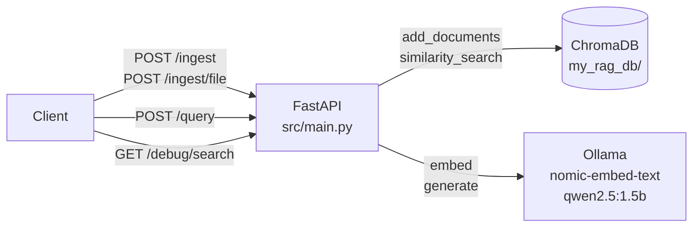

# bit-rag — Source Analysis Index

**Project**: bit-rag — Local RAG API server (FastAPI + LangChain + ChromaDB + Ollama)  
**Commit**: `a147ef43bd34036c225a6a513a907e0ff6bd99e7` + uncommitted changes (chunking pipeline rewrite in `src/main.py`, `pyproject.toml`, `uv.lock`)  
**Analyzed**: 2026-08-11

## Documents

| Document | Description |
|---|---|
| [db.md](db.md) | ChromaDB vector store schema, storage layout, data characteristics |
| [logic.md](logic.md) | API contracts, business logic, data models, test coverage |
| [ui.md](ui.md) | UI/routing analysis (API-only; no frontend) |
| [infra.md](infra.md) | Docker, Compose, CI/CD, environment variables |
| [security.md](security.md) | Security posture, access controls, known vulnerabilities |

## Project at a Glance

## Critical Findings Summary

| # | Finding | Layer | Severity |
|---|---|---|---|
| 1 | `docker-compose.yml` runs builder stage (root), not runner stage (non-root) | Infra | Medium |
| 2 | No authentication or rate limiting on any endpoint | Security | High (if network-exposed) |
| 3 | Prompt injection via `language` field passed directly to LLM prompt | Security | Medium |
| 4 | Entire chunking pipeline (`_split_thinking`, `_split_markdown`, `_split_plain_text`, `_table_tokens_to_jsonl`, and new helpers `_strip_frontmatter`/`_make_breadcrumb`/`_units_from_text`/`_pack_into_chunks`/`_chunk_section`/`_merge_short_chunks`) has no tests | Logic | Medium |
| 5 | `GET /debug/search` is public and now documented in `openapi.yml`, but still unauthenticated | Security | Low–High |
| 6 | No source metadata stored on ingest (no provenance tracking) | DB | Low |
| 7 | `bandit` not in CI (no Python security static analysis) | Security | Low |

<!-- commit: a147ef43bd34036c225a6a513a907e0ff6bd99e7 -->
