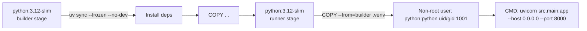
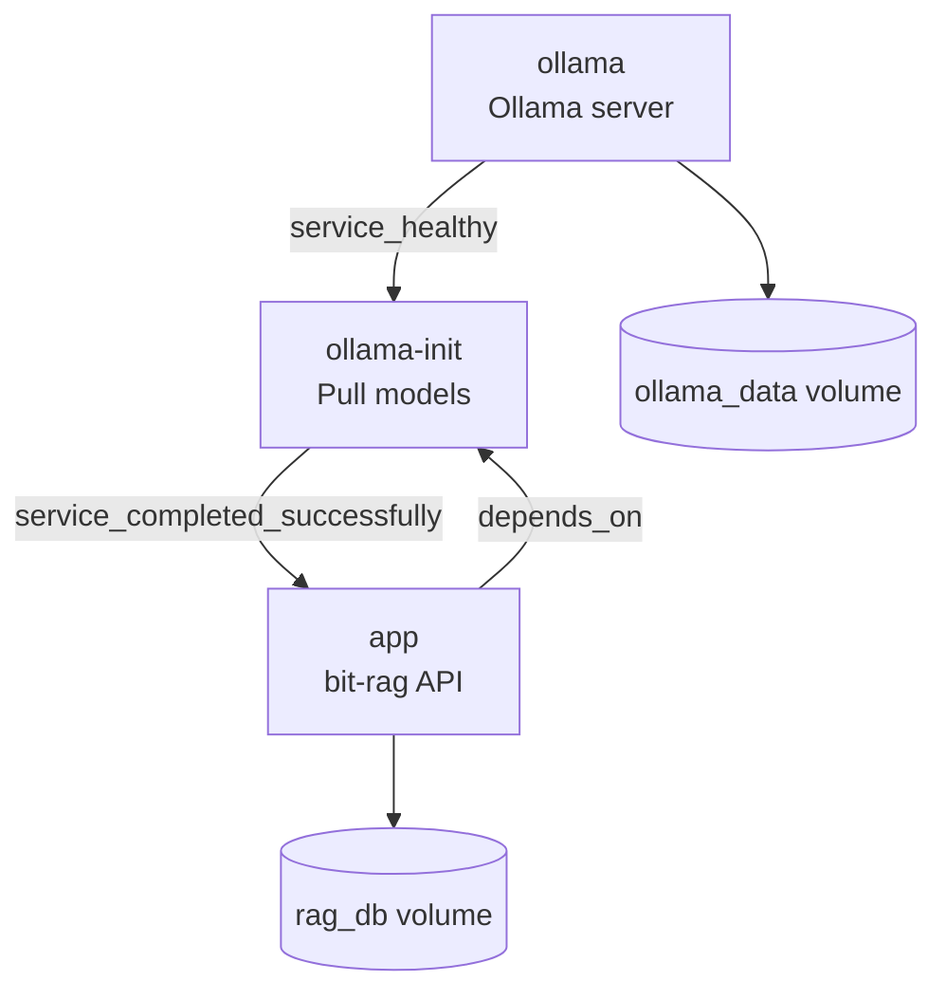

# Infra Analysis — Deployment & Environment

## Runtime Environment

| Property | Value |
|---|---|
| Language | Python 3.12 |
| Package manager | uv |
| Server | uvicorn (ASGI) |
| Default port | 8000 |
| Dev server command | `uv run uvicorn src.main:app --reload` |

## Environment Variables

| Variable | Default | Source | Effect |
|---|---|---|---|
| `PERSIST_DIR` | `./my_rag_db` | `os.getenv` | ChromaDB persistence directory |
| `EMBED_MODEL` | `nomic-embed-text` | `os.getenv` | Ollama embedding model name |
| `LLM_MODEL` | `qwen2.5:1.5b` | `os.getenv` | Ollama LLM model name |
| `RESPONSE_LANG` | `en_US` | `os.getenv` | Default response locale (BCP-47) |
| `CHUNK_SIZE` | `3200` | `os.getenv` | Max characters per ingestion chunk |
| `CHUNK_OVERLAP` | `300` | `os.getenv` | Overlap between chunks (plain-text splitter) |
| `MIN_CHUNK_SIZE` | `CHUNK_SIZE // 2` | `os.getenv` | Merge threshold for short chunks (plain-text path) |
| `OLLAMA_HOST` | *(not read by app)* | docker-compose only | Ollama server URL — passed to Ollama SDK via env |
| `PYTHONDONTWRITEBYTECODE` | — | Docker/Compose | Disable .pyc generation |
| `PYTHONUNBUFFERED` | — | Docker/Compose | Force stdout/stderr unbuffered |

> Note: `OLLAMA_HOST` is set in `docker-compose.yml` but is not explicitly read in `src/main.py`. The Ollama Python SDK (`ollama` / `langchain-ollama`) picks it up automatically from the environment.

## Docker

### Multi-Stage Dockerfile



### Known Bug — docker-compose.yml uses builder stage

`docker-compose.yml` specifies `target: builder`, which means Compose runs the **builder stage** (root user, dev-like environment) instead of the hardened **runner stage** (non-root user, clean image). The production-safe runner stage is only used when building the image without Compose.

```yaml
# docker-compose.yml (current — problematic)
build:
  context: .
  target: builder   # ← should be "runner" or omitted
```

## Docker Compose Services



| Service | Image | Role |
|---|---|---|
| `app` | local build | FastAPI RAG server |
| `ollama` | `ollama/ollama:latest` | Ollama inference server |
| `ollama-init` | `ollama/ollama:latest` | One-shot model puller (restarts: no) |

### Volumes

| Volume | Mount | Purpose |
|---|---|---|
| `rag_db` | `/app/my_rag_db` | ChromaDB persistent storage |
| `ollama_data` | `/root/.ollama` | Ollama model cache |

## CI/CD (GitHub Actions)

All workflows trigger on `push` and `pull_request` to `main`.

| Workflow | Runner | Steps |
|---|---|---|
| `test.yml` | `ubuntu-slim` | `uv sync --all-extras --dev` → `uv run pytest` |
| `lint.yml` | `ubuntu-slim` | `uvx ruff check .` |
| `format.yml` | `ubuntu-slim` | `uvx ruff format --check .` |
| `audit.yml` | `ubuntu-slim` | `uvx pip-audit` |
| `docker.yml` | `ubuntu-latest` | `docker build -t repo:sha .` |

> Note: `test.yml`, `lint.yml`, `audit.yml`, and `format.yml` use `ubuntu-slim`; `docker.yml` uses `ubuntu-latest`. No test coverage reporting or deployment step is present.

## Local Task Runner (taskipy)

| Task | Command |
|---|---|
| `uv run task dev` | `uvicorn src.main:app --reload` |
| `uv run task test` | `pytest` |
| `uv run task testv` | `pytest -v` |
| `uv run task lint` | `ruff check .` |
| `uv run task fmt` | `ruff format .` |
| `uv run task audit` | `pip-audit` |
| `uv run task sync` | `uv sync --all-extras --dev` |

## Known Issues / Inconsistencies

1. **docker-compose uses builder stage**: The `target: builder` setting bypasses the hardened runner stage (non-root user). Running Compose exposes the app as root in a dev-like environment.
2. **No test coverage gate**: CI runs pytest but does not enforce a minimum coverage threshold. The `--cov` flag is absent from `test.yml`.
3. **No deployment workflow**: CI builds and tests only. There is no push-to-registry or deploy step.
4. **`ubuntu-slim` image**: Some workflows use `ubuntu-slim` which is not a standard GitHub-hosted runner label. This may indicate a self-hosted runner or a custom runner label. Unconfirmed.

<!-- commit: a147ef43bd34036c225a6a513a907e0ff6bd99e7 -->
