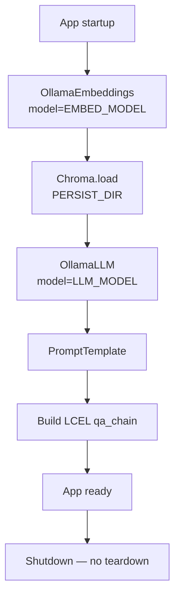
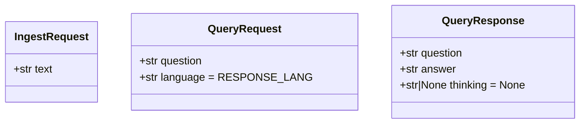
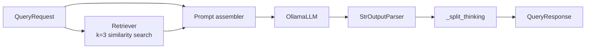

# Logic Analysis — API Contracts & Business Logic

## Application Entry Point

`src/main.py` — Single-file FastAPI application. All business logic, models, and endpoints reside here.

## Startup Lifecycle (`lifespan`)



Global singletons set on startup:
- `vectorstore: Chroma | None`
- `qa_chain` (LCEL chain) `| None`

## Data Models (Pydantic v2)



## Endpoints

### `POST /ingest`

| Field | Value |
|---|---|
| Request body | `IngestRequest` (JSON) |
| Response (impl) | `{"status": "accepted", "message": "Ingest started in background."}` HTTP 200 |
| Response (openapi.yml) | HTTP 200 |
| Background task | `process_ingest(text)` |

---

### `POST /ingest/file`

| Field | Value |
|---|---|
| Request body | `multipart/form-data` with `file: UploadFile` |
| Response (impl) | `{"status": "accepted", "message": "Ingest of '{filename}' started in background."}` HTTP 200 |
| Response (openapi.yml) | HTTP 200 |
| Error | HTTP 400 if file is not UTF-8 encoded |
| Background task | `process_ingest(text)` |

---

### `POST /query`

| Field | Value |
|---|---|
| Request body | `QueryRequest` (JSON) |
| Response | `QueryResponse` HTTP 200 |
| Error | HTTP 503 if `qa_chain is None` |
| Error | HTTP 404 if Ollama model not found (maps `ollama.ResponseError` with status 404) |
| Error | HTTP 502 for other Ollama API errors |
| Error | HTTP 503 if Ollama is unreachable (`ConnectionError`) |
| Documented in openapi.yml | Yes — 200/404/502/503 all listed |

---

### `GET /debug/search`

| Field | Value |
|---|---|
| Query params | `q: str`, `k: int = 5` |
| Response | `{"query": q, "chunks": [{"content": ..., "metadata": ...}]}` |
| Error | HTTP 503 if `vectorstore is None` |
| Documented in openapi.yml | Yes |

---

## QA Chain (LCEL)



**Prompt template** (verbatim):
```
Use the following context to answer the question.
Respond in the language specified by locale '{language}'.

Context:
{context}

Question: {question}

If you need to reason through the answer, wrap your thinking in
<think>...</think> tags, then provide the answer directly and briefly.
```

## Core Business Logic Functions

### `_split_text(text, filename=None, chunk_size=CHUNK_SIZE, chunk_overlap=CHUNK_OVERLAP)`

Dispatcher chosen by file extension. `.md` / `.markdown` (or no filename, i.e. the `/ingest` text path) go through the Markdown flow; every other extension goes through the plain-text flow.

### `_split_markdown(text, chunk_size=CHUNK_SIZE)`

Rewritten chunking pipeline for Markdown input:
1. `_strip_frontmatter` — removes a leading YAML frontmatter block (`---...---`).
2. `MarkdownHeaderTextSplitter` (`langchain_text_splitters`) — splits into sections by `#`/`##`/`###`, headers stripped from body.
3. `_chunk_section` per section — separates tables from prose using `markdown-it-py` token maps:
   - Tables → `_table_tokens_to_jsonl` (unchanged logic), one independent chunk per row.
   - Prose → `_units_from_text` (splits into bullet-vs-block units) → `_pack_into_chunks` (packs units into `chunk_size`-bounded chunks, one bullet per chunk, breadcrumb prefix `[h1 > h2 > h3]` prepended to every chunk from `_make_breadcrumb`).
4. Section order is preserved in the output list.

### `_split_plain_text(text, chunk_size=CHUNK_SIZE, chunk_overlap=CHUNK_OVERLAP)`

Non-Markdown path: `RecursiveCharacterTextSplitter` with separators `["\n\n", "\n", "。", "．", ". ", " ", ""]`, then `_merge_short_chunks(chunks, MIN_CHUNK_SIZE)` folds any chunk shorter than `MIN_CHUNK_SIZE` into the preceding one (JSON-row chunks, i.e. those starting with `{`, are never merged).

### `_table_tokens_to_jsonl(tokens, table_idx)`

Parses the markdown-it token stream to convert table rows to `{"header": "value", ...}` JSON Lines. Each data row becomes one chunk. Logic unchanged from the previous implementation.

### `_strip_frontmatter(text)` / `_make_breadcrumb(metadata)` / `_units_from_text(text)` / `_pack_into_chunks(units, chunk_size, breadcrumb)` / `_chunk_section(section_text, chunk_size, breadcrumb)` / `_merge_short_chunks(chunks, min_size)`

New helper functions introduced by the chunking rewrite. See inline docstrings in `src/main.py` for per-function detail; behavior summarized above.

### `_split_thinking(raw: str) → (answer, thinking | None)`

Extracts `<think>...</think>` blocks from raw LLM output using regex `_THINK_RE`. Returns the cleaned answer and the joined thinking content (or `None`). Unchanged.

### `process_ingest(text: str, filename: str | None = None)` (background task)

Calls `_split_text(text, filename)` → creates `Document` objects (still no `metadata` argument — filename is used only for splitter dispatch, not persisted) → calls `vectorstore.add_documents`. Silently skips if `vectorstore is None`. Now also prints each chunk's length/prefix for debugging before adding.

## Test Coverage

| Test | Target | Status |
|---|---|---|
| `test_format_docs_*` | `_format_docs` | Unit — covered |
| `test_process_ingest_skips_when_no_vectorstore` | `process_ingest` | Unit — covered |
| `test_process_ingest_adds_documents` | `process_ingest` | Unit — covered |
| `test_ingest_returns_accepted` | `POST /ingest` | API — covered |
| `test_ingest_triggers_add_documents` | `POST /ingest` | API — covered |
| `test_query_returns_answer` | `POST /query` | API — covered |
| `test_query_passes_question_to_chain` | `POST /query` | API — covered |
| `test_query_returns_503_when_not_ready` | `POST /query` | API — covered |
| `_split_thinking` | (no test) | **Not tested** |
| `_split_markdown` / `_split_plain_text` / `_split_text` | (no test) | **Not tested** |
| `_table_tokens_to_jsonl` | (no test) | **Not tested** |
| `_strip_frontmatter` / `_make_breadcrumb` / `_units_from_text` / `_pack_into_chunks` / `_chunk_section` / `_merge_short_chunks` | (no test) | **Not tested** (new in chunking rewrite) |
| `GET /debug/search` | (no test) | **Not tested** |
| `POST /ingest/file` | (no test) | **Not tested** |
| Ollama 404/502 error paths | (no test) | **Not tested** |

## Known Bugs / Inconsistencies

1. **`_split_thinking` untested**: Core response post-processing has no unit test.
2. **Chunking pipeline untested**: `_split_markdown`, `_split_plain_text`, `_table_tokens_to_jsonl`, and every new helper introduced by the chunking rewrite (`_strip_frontmatter`, `_make_breadcrumb`, `_units_from_text`, `_pack_into_chunks`, `_chunk_section`, `_merge_short_chunks`) have zero test coverage. `test/test_main.py` only covers `_format_docs` and the top-level API/background-task glue — none of the chunking logic changed by the current uncommitted diff is exercised.
3. **`POST /ingest/file` untested**: No test for file upload endpoint, including the extension-based dispatch to `_split_plain_text` vs `_split_markdown`.
4. **No source metadata**: Ingested documents carry no provenance metadata (filename, timestamp) — `process_ingest` now receives `filename` but only uses it for splitter selection, never persists it to `Document.metadata`.

<!-- commit: a147ef43bd34036c225a6a513a907e0ff6bd99e7 -->
